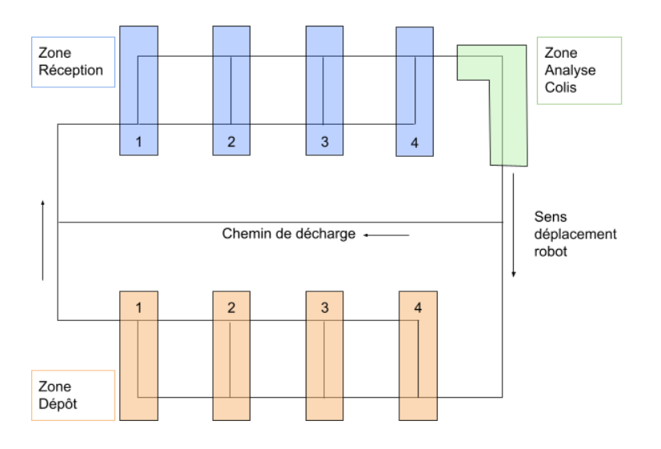

# Présentation
Le but de ce projet est de déplacer des colis de la zone de réception à la zone de dépôt à l'aide de robot mobile.  
Si le mauvais colis est chargé, le colis revient à la zone de réception.  
Les etagères seront mises à jour pendant le processus de livraison.  
Les robots mobiles possederons un système anti-collision pour éviter les autres robots.  
Les robots devront ce déplacer en suivant cette carte.  

# Principe
Le client demande un colis par le biais de l'interface en choisissant couleur et zone de chargement.  
Le robot ce déplace vers la zone de chargement uniquement si il n'est pas chargé en zone de dépot et qu'une personne a appuyer sur le bouton du robot. 
Une fois arrivé en zone de chargement il s'arrete et attend l'appuie sur le bouton.  
Si le robot est chargé la camera ce lance et scan la balle et le qr code dans la zone d'analyse, en revanche si le robot n'est pas charger à l'appuie la cam ne s'allume pas et le robot va revenir en zone de chargement pour recuperer la balle dans l'etagere où la couleur est indiqué et si aucune étagere ne comporte cette couleur le robot ira a l'etageres suivante.  
Une fois arrivé a la zone d'analyse la cam analyse la balle et le qr code.  
La couleur est renvoyé vers l'IHM qui met a jour ses informations.  
Dans le cas où la couleur est la bonne le robot retourne en zone de de dépot, en revanche si la couleur n'est pas bonne le robot retourne déposer la balle a l'étagere puis refait un tour sans l'analyse de la cam en allant recuperer la balle dans l'etagere où la couleur est indiqué et si aucune étagere ne comporte cette couleur le robot ira a l'etageres suivante. 

